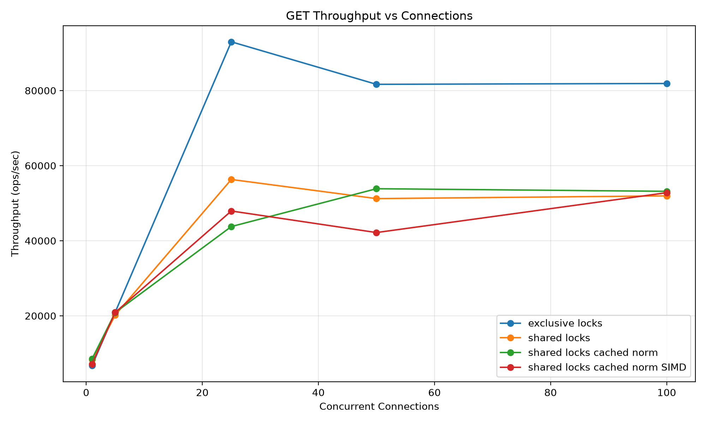
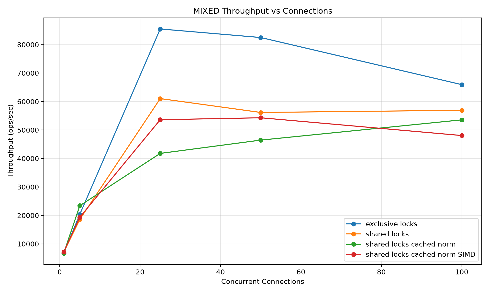
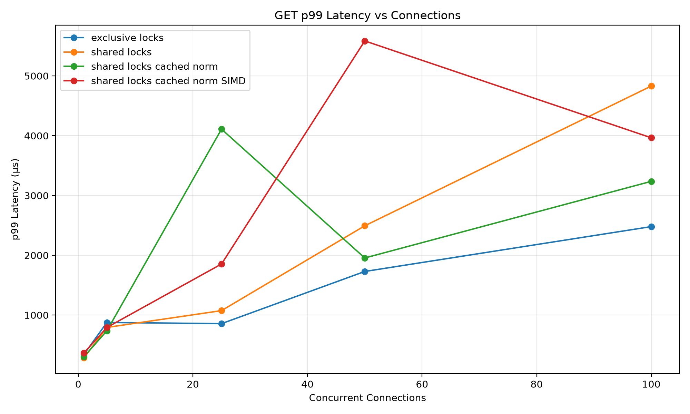
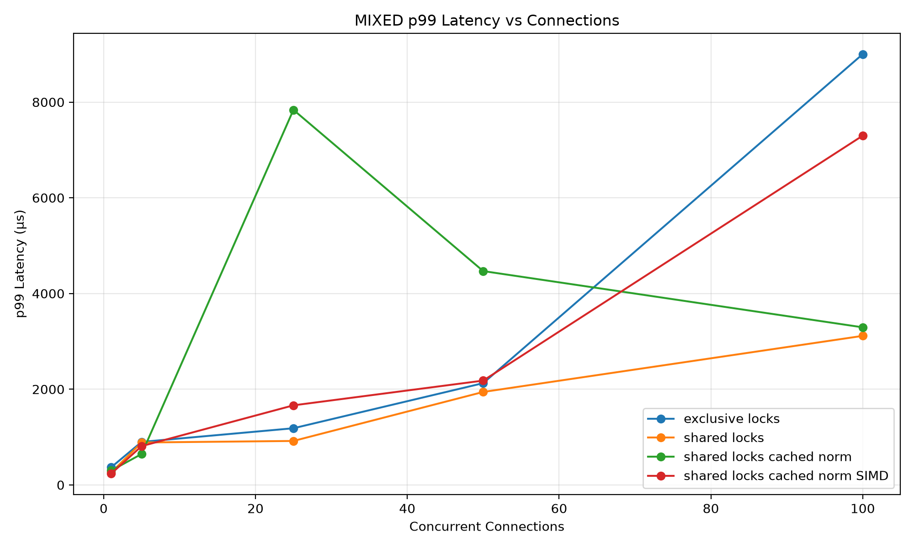

# FeatureStore

This feature store is a specialized cache for feature vectors, which are used as embeddings that ML models use to service requests.

On top of the basic SET, DEL, GET functions, TOPK / SIMILARITY provide insights into how feature vectors compare and can be used to provide recommendations.

## Purpose:

I wanted to review and go over making an internal data structure that could have a real-world use case. I started off with a basic cache, and incrementally implemented optimizations and specializations for potential use.

The cache is a key-value pair, where the value is a feature vector (embedding).

Embeddings are used in ML models to represent data as numerical vectors. This cache can be used to serve requests, like a feature store.

## Under the Hood:

The cache uses a vector for `pool`, `arena`, and an `unordered_map` for key and slot.

The `pool<Node>` stores all Nodes. Nodes are not a linked list, as contiguous memory is important for SIMD and avoiding memory fragmentation and heap allocation.

Instead, the Node struct has:

```cpp
struct Node {

    int key;

    int prev = -1;

    int next = -1;

    float norm = 0.0f;

    std::chrono::steady_clock::time_point expiration;
};
```

`norm` is so SET can pre-calculate the vector magnitude for the dot product.

The `unordered_map` provides O(1) key lookups, and it returns the index of the “slot” to find the Node.

This index can be used in `pool` to get the Node, and `arena` to do `arena[idx * dim]` to pull the actual feature vector.

`free_slots` is used to track what parts of the arena are free for data.

The cache has the following functions:

Constructor takes:

```cpp
KV_OPT::KV_OPT(int cap, int ttl, size_t dim)
```

where `dim` is the vector dimension.

```cpp
bool SET(const int& key, const std::vector<float>& vec)
```

* Checks `free_slots` for empty space, checks expiration, and updates `cache` and `free_slots`.
* Inserts the vector and calculates its norm.

```cpp
std::vector<float> KV_OPT::GET(const int& key)
```

* Retrieves the feature vector. Does a lazy check to remove expired entries.
* Has two locking phases: one shared lock to read, and one exclusive lock to remove expired entries and perform LRU re-ordering.

```cpp
bool KV_OPT::DEL(const int& key)
```

* Uses LRU to remove from the cache and updates `free_slots`.

```cpp
std::optional<float> KV_OPT::SIMILARITY(int key1, int key2)
```

* Gets the cosine similarity of two feature vectors.

```cpp
std::vector<std::pair<int, float>> KV_OPT::TOPK(int query_key, int k)
```

* Gets the top-k nearest neighbors of a given query vector.

### Utility Functions

`dot_avx2` - used when AVX2 support is available.

`dot_scalar` - if AVX2 is not available, the scalar version is used as the fallback.

# Design Process + Optimization Decisions:

In some caches, sharding a cache is how they combat lock contention. In this case, the cache is read-heavy, not write-heavy. Feature stores in the real world are loaded/batched off hours, not consistently. Obvious initial enhancements included adding `shared_mutexes`, unique for SET, but shared for GET/SIMILARITY/TOPK to allow for concurrent reads.

Note that GET does write, for LRU purposes. It does a lazy check on expiration, and updates the LRU as needed. ([Pending Optimizations](#pending-optimizations-and-improvements)) An improvement on this is to use something similar to Redis, an approximate LRU method, but I wanted to focus on other optimizations and left that as pending.

Initially, when calculating the dot product for K Nearest Neighbor (TOPK) and the cosine similarity, I was calculating the dot product each time. I updated SET to save the norm of each feature vector. This changed the **norm calculation** in TOPK and SIMILARITY from O(D) to O(1).

Finally, as I was calculating the dot product, I added SIMD functions to speed up the process. The results of these enhancements are under Benchmark Results.

## Benchmark Results

The four workloads:

| Workload     | What it demonstrates      |
| ------------ | ------------------------- |
| `get`        | Read contention / locking |
| `set`        | Write contention          |
| `similarity` | Cached norm + SIMD        |
| `topk`       | Cached norm + SIMD        |
| `mixed`      | Overall system behavior   |









# Pending Optimizations and Improvements

Change LRU to approximate/CLOCK LRU, and remove the write from GET.

Add metadata to the feature vectors as well as a FILTER function to better serve real-world use cases.

* Load/batch functions for initial loading and then updates “offline”
* Persistence

Key Value store implementation

# Main use of AI

* Generate benchmarking client

* Generate benchmarking graphs

* CMakeLists.txt generation
